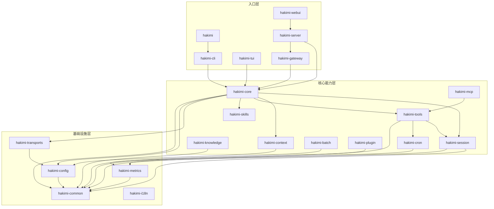
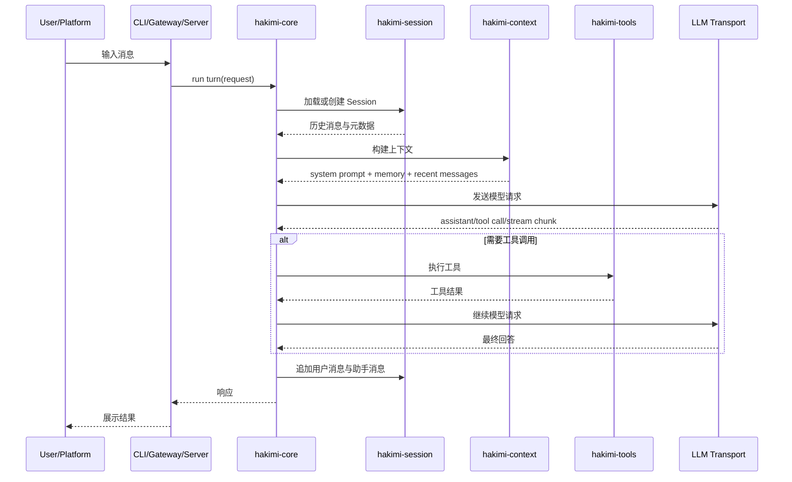
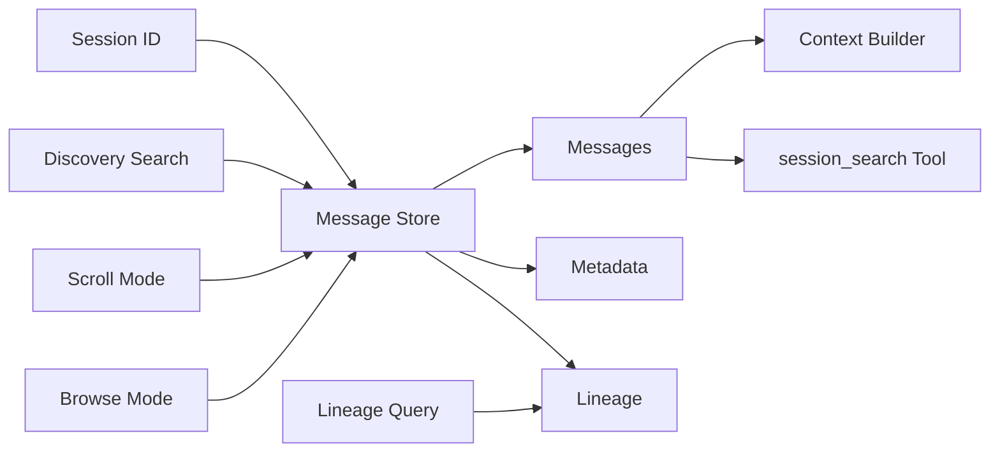
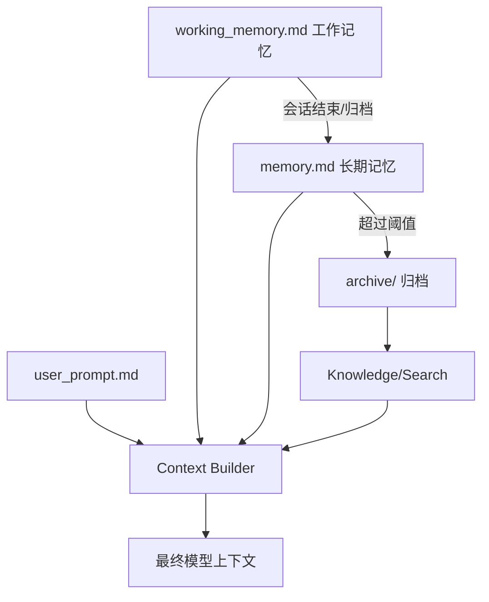
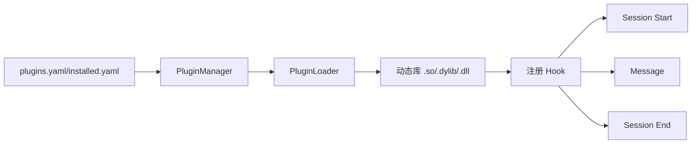

# Hakimi Agent 架构设计

> 本文面向新贡献者与维护者，目标是在 30 分钟内帮助读者理解 Hakimi Agent 的整体架构、核心数据流、关键抽象和各 crate 职责。

## 1. 系统概览

Hakimi Agent 是一个 Rust 实现的多入口 AI Agent 系统。它围绕同一个核心 Agent 运行时，提供 CLI、TUI、HTTP Server、WebUI、多平台 Gateway、定时任务、批处理、工具调用、记忆管理、技能系统和插件生态。

核心设计目标：

1. **窄核心，宽边缘**：核心负责会话、上下文、工具调度和模型交互；平台接入、UI、插件和技能尽量放在边缘模块。
2. **可观测与可恢复**：关键路径使用 tracing 与 metrics，错误带上下文，定时任务和批处理支持进度与重试。
3. **持久会话与可搜索记忆**：会话消息持久化，支持 discovery、scroll、browse、lineage 等查询模式；记忆分层存储并受容量约束。
4. **可扩展生态**：技能提供文本/提示层扩展，插件提供运行时钩子和动态加载，MCP/工具系统提供能力集成。

## 2. 工作区模块架构

Hakimi 使用 Cargo workspace 管理多个 crate。入口层 crate 调用核心能力层，核心能力层再依赖基础设施层。



### 2.1 分层说明

- **入口层**：面向用户或外部系统，负责解析输入、呈现输出、启动服务，不应承载复杂业务逻辑。
- **核心能力层**：实现 Agent 的会话、上下文、工具、知识、插件、定时任务等核心行为。
- **基础设施层**：配置、错误、传输、指标、国际化等可复用能力。

## 3. 请求处理数据流

一次典型用户请求从入口进入，经过配置加载、会话恢复、上下文构建、工具调用和模型交互，最终写回会话并返回响应。



关键约束：

- 会话历史是事实来源，工具结果和模型输出都应可追踪。
- 上下文构建必须尊重上下文窗口与记忆容量限制。
- 工具调用应通过统一 registry 调度，避免入口层直接实现业务能力。

## 4. 会话与搜索架构

`hakimi-session` 负责消息存储、查询和 lineage 关系。它为工具和核心提供统一接口。



### 4.1 Session

Session 表示一次持续对话，包含：

- `session_id`：唯一标识。
- messages：用户、助手、工具等消息序列。
- metadata：创建时间、更新时间、标签等。
- lineage：会话之间或消息之间的派生关系。

常见操作：

- 创建或加载会话。
- 追加消息。
- 搜索消息。
- 查询上下文片段。
- 追踪 lineage。

## 5. 记忆与上下文架构

Hakimi 的记忆系统以文件和索引为核心，分为用户设定、长期记忆和工作记忆。



### 5.1 Memory

记忆分层：

- **user_prompt.md**：用户身份、偏好、长期系统约束。
- **memory.md**：长期记忆，跨会话保留。
- **working_memory.md**：当前或近期任务的短期工作记忆。
- **archive/**：历史记忆归档，避免主记忆无限增长。

容量策略：

- 单个记忆文件接近 60KB 时记录 WARN。
- 超过 64KB 时拒绝加载或提示清理。
- 会话结束或显式命令可触发归档与清理。

### 5.2 Context

Context 是发送给模型的输入集合，通常包括：

1. 系统提示与运行规则。
2. 用户提示和长期偏好。
3. 工作记忆和相关知识。
4. 当前会话历史片段。
5. 工具定义和工具调用结果。

`hakimi-context` 负责控制上下文窗口、压缩策略和注入顺序。设计原则是：重要信息优先，历史信息可检索，避免无界增长。

## 6. 工具、技能、插件的边界

Hakimi 同时提供工具、技能和插件三种扩展方式，它们解决的问题不同。

| 扩展方式 | 运行位置 | 适合场景 | 示例 |
|---|---|---|---|
| Tool | 核心工具调用层 | 模型需要结构化调用的能力 | session_search、memory、cron |
| Skill | 提示/文档层 | 指导 Agent 如何完成某类任务 | Git 工作流、部署流程 |
| Plugin | 运行时钩子/动态库 | 修改运行时行为或监听事件 | session logger、analytics |
| MCP | 外部能力桥接 | 连接外部工具服务器 | filesystem、browser、API 服务 |

### 6.1 Tool

`hakimi-tools` 提供内置工具 registry，并封装工具参数、执行、错误处理和 metrics。工具可以依赖会话、定时任务、指标等模块。

### 6.2 Skill

`hakimi-skills` 面向提示与操作知识，不应把所有能力都变成核心工具。技能适合低频、文本驱动、可由现有终端/文件能力完成的流程。

### 6.3 Plugin

`hakimi-plugin` 定义插件 API、动态加载器、插件管理器和市场原型。

核心抽象：

```rust
pub trait HakimiPlugin: Send + Sync {
    fn name(&self) -> &str;
    fn on_session_start(&self, ctx: &SessionContext) -> Result<()>;
    fn on_message(&self, msg: &Message) -> Result<Option<Message>>;
    fn on_session_end(&self, ctx: &SessionContext) -> Result<()>;
}
```

插件生命周期：



插件市场负责：

- 从 YAML registry 读取插件元数据。
- 根据平台选择二进制文件。
- 从 GitHub Releases 下载。
- SHA256 校验。
- 写入本地 installed manifest。

## 7. Crate 职责速查表

| Crate | 职责 | 典型依赖/交互 |
|---|---|---|
| `hakimi` | 顶层二进制包装 | 调用 CLI |
| `hakimi-cli` | 命令行入口、子命令解析 | core、config、tools、gateway |
| `hakimi-core` | Agent 核心编排，模型请求、工具循环、会话协调 | session、context、tools、transports、skills |
| `hakimi-server` | HTTP/API 服务端，WebUI 后端 | core、session、gateway、metrics |
| `hakimi-webui` | Web UI 前端/静态资源相关 | server |
| `hakimi-tui` | 终端 UI | core、tools、context、gateway |
| `hakimi-gateway` | 多平台消息网关 | core、transports、config |
| `hakimi-transports` | 模型/平台传输抽象 | config、common |
| `hakimi-config` | 配置加载、默认值、路径解析 | common |
| `hakimi-common` | 通用错误、类型、工具函数 | 无核心业务依赖 |
| `hakimi-session` | 会话存储、消息查询、lineage | common、metrics |
| `hakimi-context` | 上下文构建、记忆注入、压缩策略 | config |
| `hakimi-tools` | 内置工具 registry 与执行 | session、cron、metrics |
| `hakimi-cron` | 定时任务、重试、调度 | common |
| `hakimi-batch` | 批处理与进度追踪 | common |
| `hakimi-knowledge` | 知识库、搜索、版本化 | common |
| `hakimi-skills` | 技能加载与提示层扩展 | 独立为主 |
| `hakimi-mcp` | MCP 集成 | tools、transports |
| `hakimi-plugin` | 插件 API、加载、市场 | common |
| `hakimi-metrics` | Prometheus/OpenTelemetry 指标 | 独立为主 |
| `hakimi-i18n` | 国际化资源 | 独立为主 |

## 8. 配置与运行时目录

默认用户目录为 `~/.hakimi/`。典型结构：

```text
~/.hakimi/
├── config.yaml              # 全局配置
├── sessions.db              # 会话数据库或索引
├── memory/
│   ├── user_prompt.md       # 用户身份/偏好
│   ├── memory.md            # 长期记忆
│   ├── working_memory.md    # 工作记忆
│   └── archive/             # 归档记忆
├── plugins/
│   ├── installed.yaml       # 已安装插件清单
│   └── *.so|*.dylib|*.dll   # 插件动态库
├── knowledge/               # 知识库数据
├── cron/                    # 定时任务状态
└── logs/
    └── hakimi.log           # 日志
```

配置示例：

```yaml
session:
  default_model: "gpt-4"
  context_window: 8000

memory:
  max_size: 65536
  auto_archive: true

plugins:
  enabled:
    - logger

observability:
  metrics: true
  tracing: true
```

约定：

- 用户可见的行为配置放入 `config.yaml`。
- API key、token、密码等敏感信息可使用环境变量或 secret 管理。
- 模块不得各自发明不兼容的配置路径。

## 9. 可观测性

Hakimi 的稳定性建设包括三层：

1. **tracing spans**：关键路径记录 session_id、查询模式、耗时、结果数量。
2. **metrics**：Prometheus/OpenTelemetry 指标，如搜索耗时、记忆加载大小、压缩比例。
3. **结构化错误**：错误包含上下文信息，例如 session_id、user_id、timestamp。

典型指标：

```text
session_search_duration_seconds{mode="discovery"}
memory_load_bytes{target="working"}
context_compression_ratio
```

## 10. 开发时如何定位代码

常见需求与入口：

| 需求 | 首先查看 |
|---|---|
| 修改一次对话的执行流程 | `crates/hakimi-core` |
| 添加 CLI 子命令 | `crates/hakimi-cli` |
| 修改会话搜索 | `crates/hakimi-session` 与 `crates/hakimi-tools` |
| 修改记忆注入 | `crates/hakimi-context` |
| 添加内置工具 | `crates/hakimi-tools` |
| 接入新平台 | `crates/hakimi-gateway` 或 `hakimi-transports` |
| 添加插件能力 | `crates/hakimi-plugin` |
| 添加指标 | `crates/hakimi-metrics` 与调用模块 |
| 修改 WebUI/API | `crates/hakimi-server` 与 `crates/hakimi-webui` |

## 11. 贡献设计原则

- 优先扩展已有抽象，避免新增平行体系。
- 工具是高成本接口：只有模型确实需要结构化调用时才加入核心工具。
- 技能适合文档化流程，插件适合运行时扩展，MCP 适合外部服务桥接。
- 测试应验证行为契约，而不是冻结容易变化的列表或版本号。
- 涉及配置、路径、数据库、网络、权限边界的修改，应写集成测试。

## 12. 快速阅读路径

如果你只有 30 分钟：

1. 先看第 2 节模块架构图。
2. 再看第 3 节请求处理数据流。
3. 阅读第 7 节 crate 职责表。
4. 根据你的任务跳转到第 10 节对应模块。
5. 最后阅读第 11 节贡献设计原则，避免走错扩展方向。

---

本文档会随着架构演进持续更新。若新增 crate、核心数据流或扩展点，请同步更新本文档与 `EVOLUTION_ROADMAP.md`。
