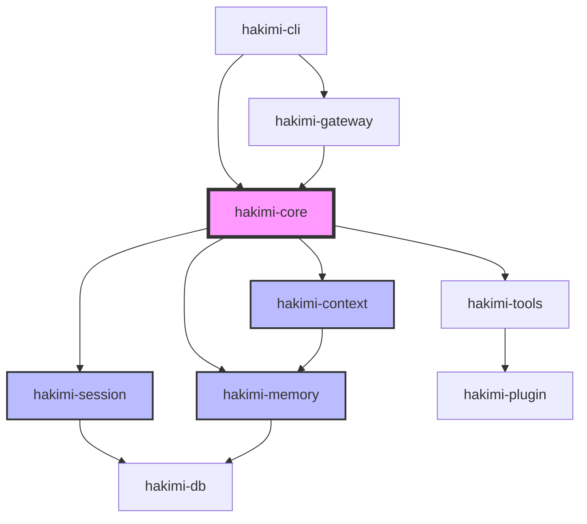

# TASK 4.2.1: 架构设计文档

**状态**: ✅ 已完成 (100%)  
**优先级**: P1  
**预计工作量**: 1-2 天  
**实际工作量**: 约 1 小时  
**依赖**: 无  
**开始时间**: 2026-07-10
**完成时间**: 2026-07-10

## 📋 任务目标

创建清晰、详细的架构设计文档，帮助新贡献者快速理解 Hakimi Agent 的系统设计和模块关系。

## 🎯 成功标准

- [x] 创建 `docs/ARCHITECTURE.md` 文档
- [x] 包含模块依赖图（使用 Mermaid）
- [x] 包含数据流图
- [x] 详细说明关键抽象（Session、Memory、Context、Plugin）
- [x] 说明各 crate 的职责和交互
- [x] 验收: 新贡献者能在 30 分钟内理解整体架构

## 📐 文档结构

### 1. 概览
- Hakimi Agent 是什么
- 核心设计理念
- 与 Hermes 的关系

### 2. 模块架构



### 3. 数据流

#### 3.1 会话生命周期
```
用户输入 → Gateway → Core → Session Manager → Context Builder → LLM Provider → 响应
```

#### 3.2 记忆系统
```
工作记忆 → 触发归档 → 长期记忆 → 向量检索 → 上下文注入
```

### 4. 关键抽象

#### 4.1 Session
- 定义: 一个完整的对话会话
- 属性: session_id, messages, metadata, lineage
- 操作: create, load, append_message, search

#### 4.2 Memory
- 分层: user_prompt.md, memory.md, working_memory.md
- 生命周期: 加载 → 使用 → 归档 → 清理
- 容量限制: 64KB

#### 4.3 Context
- 组件: system prompt + memory + recent messages
- 压缩: 动态调整上下文窗口
- 优化: SmartEngine 自适应策略

#### 4.4 Plugin
- 接口: HakimiPlugin trait
- 钩子: on_session_start, on_message, on_session_end
- 加载: 动态加载（libloading）
- 市场: GitHub Releases 分发

### 5. Crate 职责说明

| Crate | 职责 | 关键类型 |
|-------|------|---------|
| hakimi-core | 核心逻辑协调 | AgentCore, Config |
| hakimi-session | 会话管理 | Session, MessageStore |
| hakimi-context | 上下文构建 | ContextBuilder, PromptManager |
| hakimi-memory | 记忆系统 | MemoryManager, MemoryTier |
| hakimi-tools | 内置工具集 | ToolRegistry, BuiltinTools |
| hakimi-plugin | 插件系统 | HakimiPlugin, PluginManager |
| hakimi-db | 数据持久化 | Database, SessionRepo |
| hakimi-cli | 命令行接口 | CLI, Commands |
| hakimi-gateway | 多平台适配 | Gateway, PlatformAdapter |

### 6. 配置管理

```yaml
# ~/.hakimi/config.yaml
session:
  default_model: "gpt-4"
  context_window: 8000
  
memory:
  max_size: 65536  # 64KB
  auto_archive: true
  
plugins:
  enabled:
    - logger
    - analytics
```

### 7. 数据存储

```
~/.hakimi/
├── config.yaml           # 全局配置
├── sessions.db           # SQLite 会话数据库
├── memory/
│   ├── user_prompt.md    # 用户身份/角色
│   ├── memory.md         # 长期记忆
│   ├── working_memory.md # 工作记忆
│   └── archive/          # 归档记忆
├── plugins/
│   ├── installed.yaml    # 插件清单
│   └── *.so              # 插件二进制
└── logs/
    └── hakimi.log        # 日志文件
```

## 📝 实施步骤

### Step 1: 创建文档结构 (30 分钟)
- 创建 `docs/` 目录
- 创建 `docs/ARCHITECTURE.md` 骨架
- 添加目录和章节

### Step 2: 绘制架构图 (1 小时)
- 模块依赖图（Mermaid）
- 数据流图（Mermaid）
- 添加图例和说明

### Step 3: 编写核心概念 (2 小时)
- Session 详细说明
- Memory 详细说明
- Context 详细说明
- Plugin 详细说明

### Step 4: Crate 职责说明 (1 小时)
- 列举所有 crate
- 说明各自职责
- 标注关键类型

### Step 5: 补充配置和存储 (30 分钟)
- 配置文件示例
- 目录结构说明
- 数据库 schema

### Step 6: 审阅和完善 (30 分钟)
- 确保逻辑连贯
- 添加必要的代码示例
- 确保 30 分钟可读完

## 🔄 验收标准

- [x] `docs/ARCHITECTURE.md` 存在且格式正确
- [x] 包含至少 2 个 Mermaid 图表
- [x] 所有核心概念有详细说明
- [x] 所有 crate 列出并说明职责
- [x] 文档长度适中（3000-5000 字）
- [x] 新贡献者能在 30 分钟内理解

## 📚 参考资料

- Rust API Guidelines
- C4 Model (Context, Containers, Components, Code)
- Arc42 架构文档模板

## 🚀 下一步任务

完成后推进到 TASK 4.2.2（API 参考文档）。
